# Practica Filament

Proyecto de aprendizaje construido siguiendo un curso de YouTube sobre **FilamentPHP**. El objetivo no es un producto terminado, sino practicar Filament (panel de administración, Resources, RelationManagers, plugins) antes de abordar la migración de un ERP de gestión de una empresa de obras y reformas a Laravel + Filament.

---

## Índice

- [Descripción del proyecto](#descripción-del-proyecto)
- [Capturas de pantalla](#capturas-de-pantalla)
- [Tecnologías utilizadas](#tecnologías-utilizadas)
- [Paquetes instalados y para qué sirve cada uno](#paquetes-instalados-y-para-qué-sirve-cada-uno)
- [Estructura del proyecto](#estructura-del-proyecto)
- [Rutas públicas](#rutas-públicas)
- [Modelos y relaciones](#modelos-y-relaciones)
- [Autorización (Policies)](#autorización-policies)
- [Roles y usuarios de acceso](#roles-y-usuarios-de-acceso)
- [Cómo levantar el proyecto en local](#cómo-levantar-el-proyecto-en-local)
- [Comandos útiles de Filament / Laravel](#comandos-útiles-de-filament--laravel)
- [Notas y particularidades de esta instalación](#notas-y-particularidades-de-esta-instalación)

---

## Descripción del proyecto

`filament-practica` es un **portal de noticias básico** (posts, categorías, comentarios) construido con Laravel + FilamentPHP como panel de administración. Es un proyecto de calentamiento antes de migrar un ERP de gestión de una empresa de obras y reformas a Laravel + Filament.

El elemento **principal y protagonista del proyecto es Filament**: la parte pública (Blade + rutas clásicas) es solo una capa mínima para poder consumir los datos gestionados desde el panel.

Qué se practica aquí:

- Un panel de administración completo con **Filament Resources** (Posts, Categorías, Comentarios, Usuarios, Roles).
- **RelationManagers** para gestionar relaciones anidadas (comentarios dentro de un post) sin salir de la pantalla de edición del padre.
- Gestión de **roles y permisos** con Spatie Permission.
- Gestión de **medios/imágenes** con un plugin dedicado.
- Integración de plugins de terceros de la comunidad Filament (backups, monitorización de estado, monitor de colas, exportación a Excel).
- Una parte pública en Blade con tres secciones separadas, cada una con su propio controlador (patrón `index`/`show`):
  - **Inicio** (`/`): landing con la descripción del proyecto y accesos rápidos a Noticias y Categorías.
  - **Noticias** (`/posts`): listado completo de posts, con su vista de detalle (`/posts/{slug}`).
  - **Categorías** (`/categories`): listado de categorías con nº de posts, y detalle de los posts de cada una (`/categories/{id}`).
- **Componentes Blade** (`<x-nav>`, `<x-footer>`) reutilizados en las cinco vistas públicas, para no repetir el menú ni el pie en cada archivo.

---

## Capturas de pantalla

> Todas las capturas incluyen la barra de dirección del navegador (con la URL visible) para que se vea claramente qué ruta corresponde a cada pantalla — recorta el resto de la ventana (VirtualBox, barra de marcadores) para que quede limpio.

**Panel de administración — pantalla de acceso**

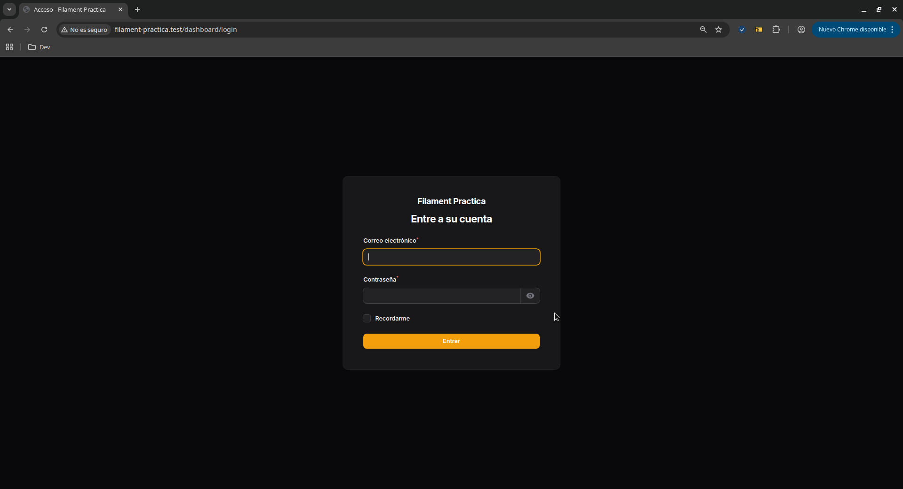

<br>

**Panel de administración — gestión de contenido**

<table>
  <tr>
    <td width="50%">
      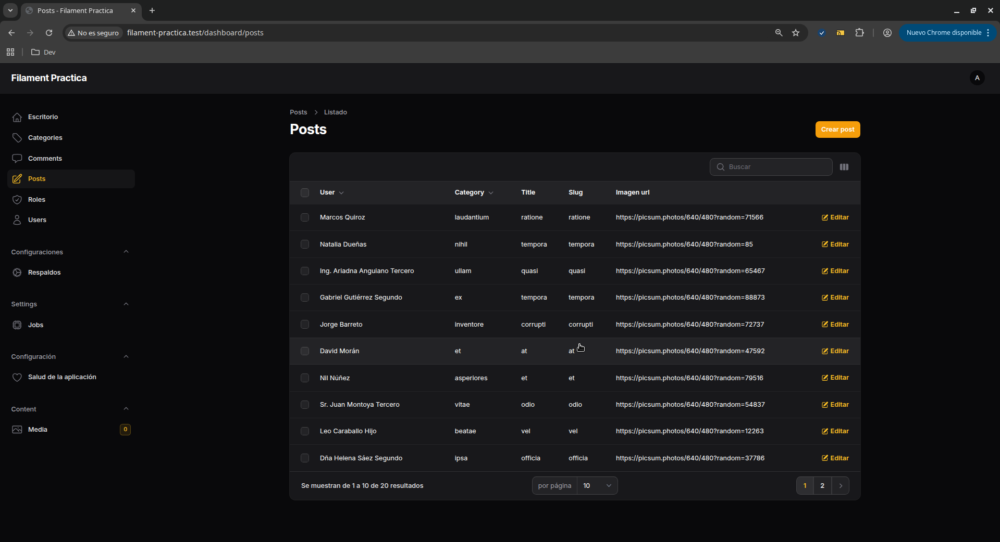
      <p align="center"><sub>Listado de Posts — <code>/dashboard/posts</code></sub></p>
    </td>
    <td width="50%">
      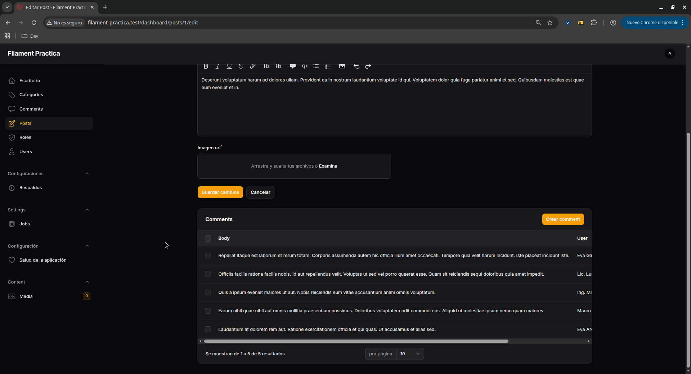
      <p align="center"><sub>Comentarios de un post gestionados desde su RelationManager</sub></p>
    </td>
  </tr>
</table>

**Panel de administración — roles y permisos**

<table>
  <tr>
    <td width="50%">
      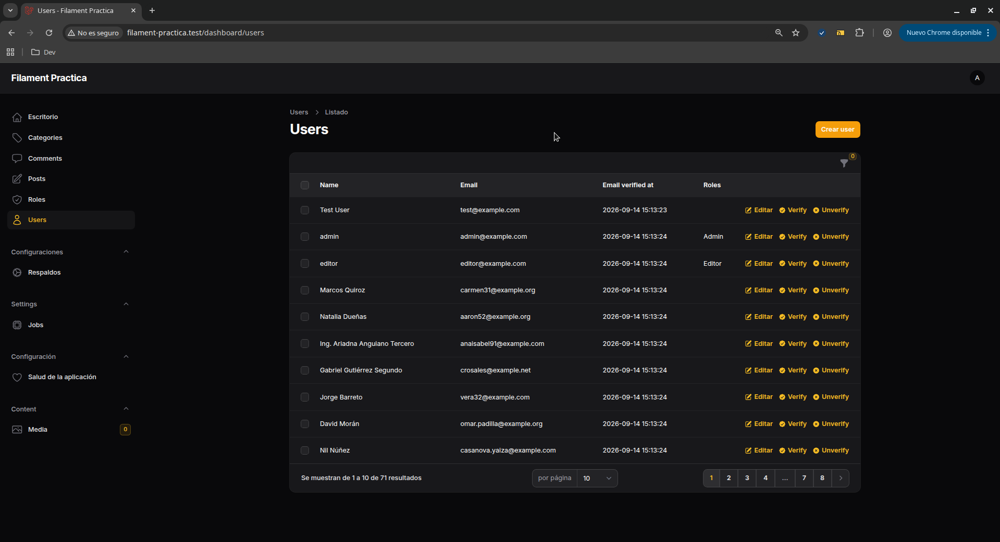
      <p align="center"><sub>Menú lateral con sesión de <strong>Admin</strong> — incluye Usuarios y Roles</sub></p>
    </td>
    <td width="50%">
      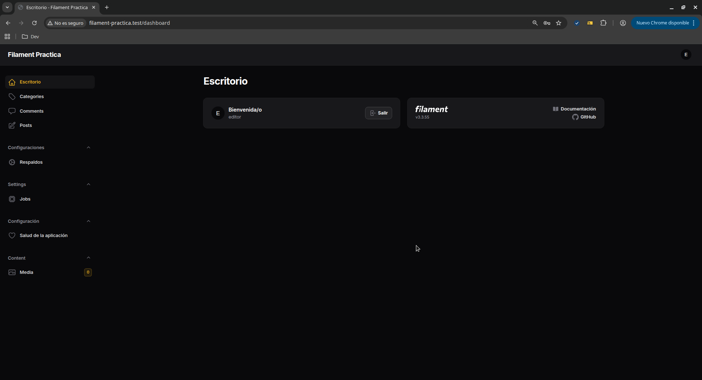
      <p align="center"><sub>Menú lateral con sesión de <strong>Editor</strong> — sin Usuarios ni Roles</sub></p>
    </td>
  </tr>
</table>

**Parte pública — Inicio**

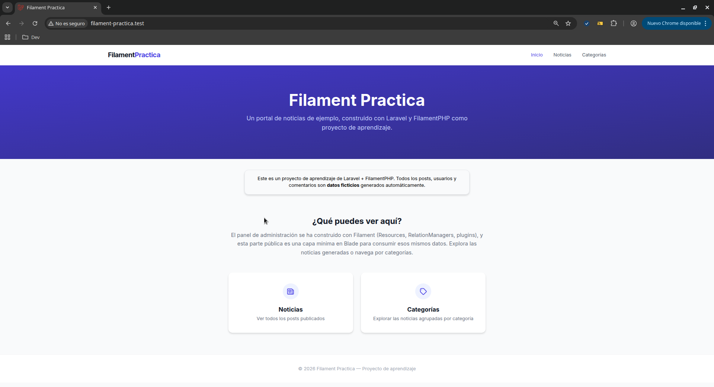
<p align="center"><sub>Landing con la descripción del proyecto y accesos a Noticias/Categorías — <code>/</code></sub></p>

<br>

**Parte pública — Noticias**

<table>
  <tr>
    <td width="50%">
      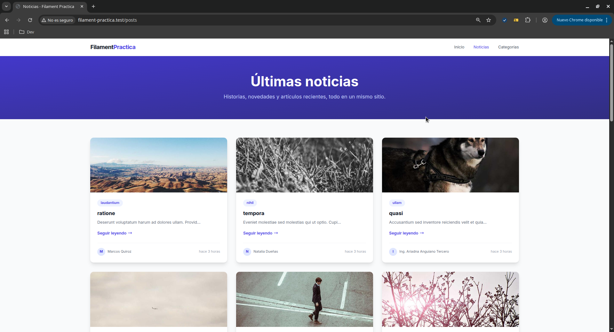
      <p align="center"><sub>Listado de posts — <code>/posts</code></sub></p>
    </td>
    <td width="50%">
      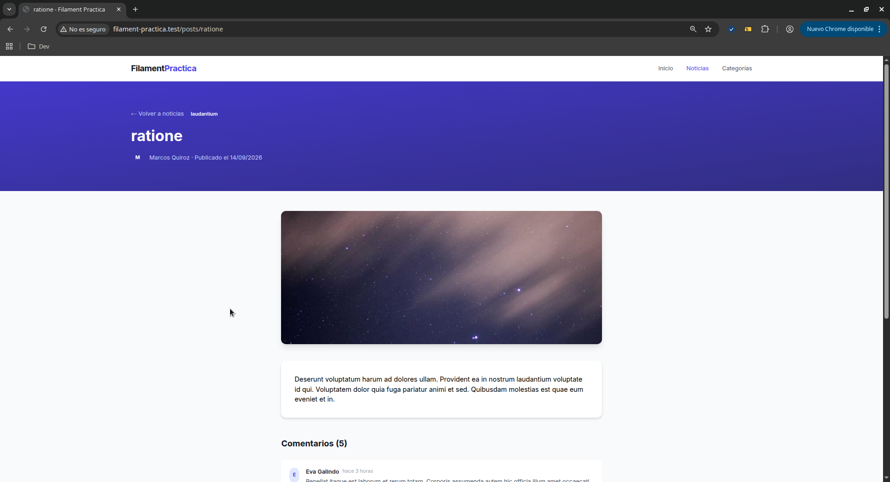
      <p align="center"><sub>Post individual con sus comentarios — <code>/posts/{slug}</code></sub></p>
    </td>
  </tr>
</table>

**Parte pública — Categorías**

<table>
  <tr>
    <td width="50%">
      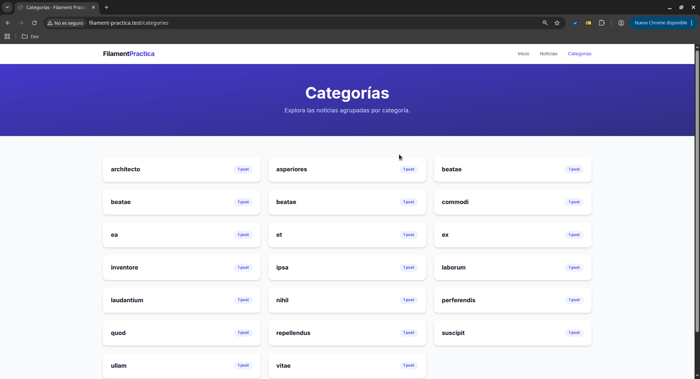
      <p align="center"><sub>Listado de categorías con nº de posts — <code>/categories</code></sub></p>
    </td>
    <td width="50%">
      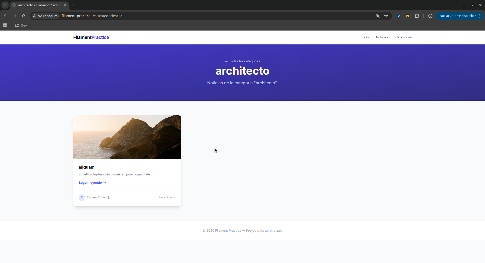
      <p align="center"><sub>Posts de una categoría concreta — <code>/categories/{id}</code></sub></p>
    </td>
  </tr>
</table>

---

## Tecnologías utilizadas

| Categoría | Tecnología |
|---|---|
| **Panel de administración** | **FilamentPHP 3.x** (protagonista del proyecto) |
| Framework backend | Laravel 12 |
| Lenguaje | PHP 8.4 |
| Base de datos | MariaDB |
| Frontend público | Blade + Tailwind CSS (CDN) |
| Entorno de desarrollo | Docker + Laradock (nginx, php-fpm, mariadb, phpmyadmin, workspace) |
| Editor de imágenes en formularios | Cropper.js (vía plugin de medios) |

---

## Paquetes instalados y para qué sirve cada uno

Solo se listan los paquetes añadidos manualmente sobre el Laravel base — no las dependencias que trae Laravel/Filament por defecto.

### `filament/filament` (`^3.0-stable`)
El framework de administración en sí. Todo el proyecto gira en torno a él: Resources, Forms, Tables, panel de login, plugins.

### `althinect/filament-spatie-roles-permissions` (`2.3.0`, versión fijada)
Capa de UI de Filament sobre `spatie/laravel-permission`: genera los Resources de **Role** y permite asignar roles a usuarios desde un `Select` en el formulario. Se fijó la versión `2.3.0` porque versiones más recientes de la rama 2.x usan una firma de `getNavigationGroup()` incompatible con Filament 3.3.55, y la rama 3.x del paquete exige Filament 4/5.

### `awcodes/filament-curator` (`^3.7`)
Gestor de medios/imágenes para Filament. Sustituye al `FileUpload` básico por una librería de medios reutilizable (subida, recorte con Cropper.js, badge de conteo en el menú). En esta versión (`3.7`), métodos como `showBadge()`, `curations()` o `fileSwap()` **no existen** — son de la rama 4.x (Filament 5); el equivalente correcto aquí es `navigationCountBadge()`.

### `croustibat/filament-jobs-monitor` (`^2.0`, versión fijada)
Monitor de trabajos en cola (queue jobs) integrado en el panel, inspirado en Laravel Horizon. Se fijó a la rama `2.x` porque la versión por defecto (más reciente) exige Filament 4/5. Con Filament 3.x, la versión correcta es siempre `2.x`.

### `pxlrbt/filament-excel` (`^2.5`)
Exportación de tablas de Filament a Excel/CSV directamente desde las acciones de tabla (`ExportAction`, `ExportBulkAction`). Depende de `maatwebsite/excel`, que a su vez requiere las extensiones PHP `gd` y `zip`.

### `shuvroroy/filament-spatie-laravel-backup` (`^2.2`)
UI en el panel para `spatie/laravel-backup`: lanzar copias de seguridad de la base de datos y archivos, y ver el listado de backups generados, sin salir de Filament.

### `shuvroroy/filament-spatie-laravel-health` (`^2.3`)
UI en el panel para `spatie/laravel-health`: muestra el estado de salud de la aplicación (modo debug, entorno, optimización) en una pantalla dedicada del panel.

### `spatie/laravel-permission` (dependencia transitiva de Althinect)
El motor real de roles y permisos (tablas `roles`, `permissions`, `model_has_roles`...). El paquete de Althinect es solo la capa visual sobre este.

---

## Estructura del proyecto

Se documentan únicamente los directorios/archivos **generados manualmente** durante el desarrollo — no la estructura por defecto de un `laravel new`.

```
app/
├── Http/Controllers/
│   ├── HomeController.php          # Landing pública ("/")
│   ├── PostController.php          # Listado y detalle de posts ("/posts", "/posts/{slug}")
│   └── CategoryController.php      # Listado y detalle de categorías ("/categories", "/categories/{id}")
├── Models/
│   ├── Post.php                    # Modelo de noticias
│   ├── Category.php                # Categoría de un post
│   ├── Comment.php                 # Comentario de un post
│   └── Role.php                    # Extiende el modelo Role de Spatie
├── Policies/
│   ├── UserPolicy.php              # Autorización sobre el modelo User (solo rol Admin)
│   └── RolePolicy.php              # Autorización sobre el modelo Role (solo rol Admin)
├── Filament/
│   └── Resources/
│       ├── PostResource.php                          # CRUD de posts en el panel
│       │   └── RelationManagers/
│       │       └── CommentsRelationManager.php       # Gestión de comentarios dentro de un post
│       ├── CategoryResource.php                      # CRUD de categorías
│       ├── CommentResource.php                       # CRUD independiente de comentarios (con selector de post)
│       ├── UserResource.php                          # CRUD de usuarios (con selector de roles)
│       └── RoleResource.php                          # CRUD de roles

resources/views/
├── components/
│   ├── nav.blade.php               # Menú de navegación, reutilizado en todas las páginas públicas
│   └── footer.blade.php            # Pie de página, reutilizado en todas las páginas públicas
├── home.blade.php                  # Landing pública
├── posts/
│   ├── index.blade.php             # Listado de posts
│   └── show.blade.php              # Post individual + comentarios
└── categories/
    ├── index.blade.php             # Listado de categorías
    └── show.blade.php              # Posts de una categoría concreta

routes/web.php                      # Rutas públicas: home, posts.index/show, categories.index/show

database/
├── factories/
│   ├── PostFactory.php
│   ├── CategoryFactory.php
│   └── CommentFactory.php
├── seeders/
│   └── DatabaseSeeder.php          # Crea roles, usuarios de prueba (admin/editor) y datos ficticios
└── migrations/
    ├── ..._create_categories_table.php
    ├── ..._create_posts_table.php
    └── ..._create_comments_table.php
```

Las migraciones de `permission_tables`, `media_table`, `health_tables` y `filament-jobs-monitor_table` las genera cada paquete respectivo (`vendor:publish`) y no se han modificado a mano.

---

## Rutas públicas

| Método | URI | Nombre | Controlador |
|---|---|---|---|
| GET | `/` | `home` | `HomeController@index` |
| GET | `/posts` | `posts.index` | `PostController@index` |
| GET | `/posts/{post:slug}` | `posts.show` | `PostController@show` |
| GET | `/categories` | `categories.index` | `CategoryController@index` |
| GET | `/categories/{category}` | `categories.show` | `CategoryController@show` |

`/posts/{post:slug}` usa **Route Model Binding** por la columna `slug` en vez del `id` por defecto — la resolución del modelo la hace la ruta, no el controlador.

---

## Modelos y relaciones

- **User → Post**: un usuario puede escribir muchos posts, pero cada post pertenece a un único usuario (autor).
- **Category → Post**: una categoría agrupa muchos posts, pero cada post pertenece a una única categoría.
- **Post → Comment**: un post puede tener muchos comentarios, pero cada comentario pertenece a un único post.
- **User → Comment**: un usuario puede escribir muchos comentarios, pero cada comentario pertenece a un único usuario.
- **User ↔ Role**: relación muchos-a-muchos gestionada por `spatie/laravel-permission` — un usuario puede tener varios roles, y un rol puede asignarse a varios usuarios.

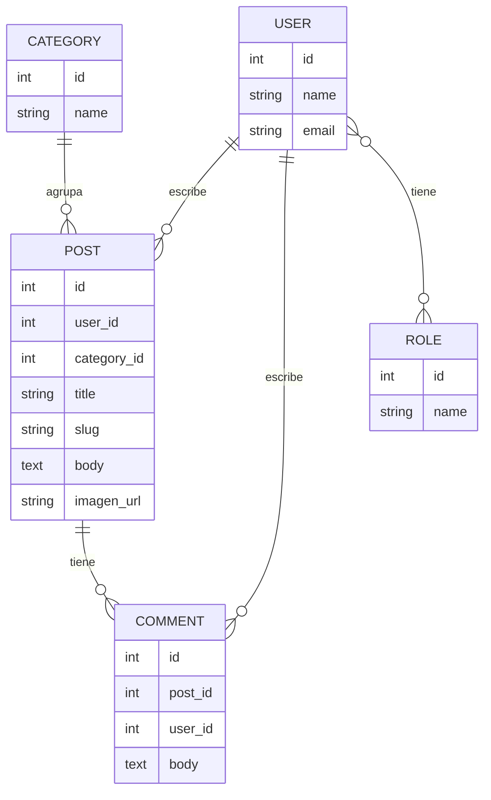

---

## Autorización (Policies)

Laravel descubre las Policies automáticamente **por convención de nombre**: para el modelo `App\Models\User`, busca la clase `App\Policies\UserPolicy`; para `App\Models\Role`, busca `App\Policies\RolePolicy`. No hace falta registrarlas a mano en ningún proveedor si el nombre coincide exactamente.

En este proyecto hay dos:

- **`UserPolicy`**: controla el acceso al Resource de Usuarios (ver, crear, editar, borrar, restaurar). Todas las acciones exigen que el usuario autenticado tenga el rol `Admin`.
- **`RolePolicy`**: controla el acceso al Resource de Roles, con la misma restricción — solo `Admin` puede gestionar roles.

Filament respeta estas Policies automáticamente: si un usuario sin el rol `Admin` intenta entrar a `/dashboard/users` o `/dashboard/roles`, el Resource correspondiente ni siquiera se muestra en el menú.

> **Nota de aprendizaje**: el nombre de la clase debe coincidir exactamente con el patrón `NombreDelModelo` + `Policy` para que Laravel la detecte sola. Un simple error de tipeo en el nombre de la clase (por ejemplo `USerPolicy` en vez de `UserPolicy`) hace que Laravel no la reconozca y la ignore silenciosamente, sin lanzar ningún error — el fallo es puramente de convención de nombre, no de sintaxis.

---

## Roles y usuarios de acceso

El `DatabaseSeeder` crea dos roles (vía `spatie/laravel-permission`) y un usuario de ejemplo para cada uno.

| Rol | Qué puede hacer | Qué NO puede hacer |
|---|---|---|
| **Admin** | Todo: gestionar Posts, Categorías, Comentarios, y además **Usuarios** y **Roles** | — |
| **Editor** | Gestionar Posts, Categorías y Comentarios (no hay Policy que lo restrinja ahí, así que Filament lo permite por defecto) | Entrar a los Resources de **Usuarios** y **Roles** — `UserPolicy` y `RolePolicy` exigen el rol `Admin`, así que esos dos elementos del menú ni siquiera aparecen para un Editor |

Es decir: la diferencia entre ambos roles en este proyecto se reduce exactamente a lo que cubren `UserPolicy` y `RolePolicy` — como no existe ninguna Policy para `Post`, `Category` ni `Comment`, un Editor tiene acceso completo a esos tres Resources igual que un Admin.

### Usuarios de prueba (creados por el seeder)

| Rol | Email | Contraseña |
|---|---|---|
| Admin | `admin@example.com` | `admin` |
| Editor | `editor@example.com` | `editor` |

También existe un tercer usuario, `test@example.com` (contraseña generada por la factory, sin rol asignado), útil para comprobar qué ve alguien **sin ningún rol**: no vería ni Usuarios ni Roles en el menú, igual que un Editor.

```bash
php artisan migrate:fresh --seed
```

recrea estos tres usuarios desde cero cada vez.

---

## Cómo levantar el proyecto en local

Entorno usado: **Laradock** (Docker) sobre una VM Debian, con `nginx`, `mariadb`, `php-fpm`, `phpmyadmin` y `workspace`.

### 1. Clonar el proyecto e instalar dependencias

```bash
git clone git@github.com:pdawgabriel-hub/filament-practica.git
cd filament-practica
composer install
npm install
```

### 2. Configurar el entorno

```bash
cp .env.example .env
php artisan key:generate
```

Edita `.env` con las credenciales de tu base de datos (host `mariadb` si usas Laradock, `filament_practica` como nombre de usuario/BD/contraseña, ajusta a tu gusto) y asegúrate de que `APP_ENV=local`.

### 3. Levantar los contenedores (Laradock)

```bash
cd laradock
docker compose up -d nginx mariadb php-fpm phpmyadmin workspace
```

> No uses `docker compose restart` a secas: este proyecto convive con un contenedor `mysql` que compite por el puerto 3306 con `mariadb`. Reinicia siempre servicios concretos: `docker compose restart php-fpm nginx`.

### 4. Extensiones PHP necesarias en el contenedor `php-fpm`

Este proyecto necesita más extensiones de las que trae PHP por defecto:

```bash
docker exec -ti laradock-php-fpm-1 bash
apt update
apt install -y php8.4-intl php8.4-zip php8.4-gd
exit
```

`exif` es distinta: no es un paquete `apt` en la imagen de Laradock, sino un flag de build del Dockerfile. Actívala en `laradock/.env`:

```
INSTALL_EXIF=true
```

y reconstruye la imagen:

```bash
docker compose build php-fpm
docker compose up -d php-fpm
```

### 5. Migraciones y storage

```bash
php artisan migrate
```

Enlace simbólico de storage (hecho manualmente dentro del contenedor `workspace`, en vez de `artisan storage:link`, para evitar rutas absolutas que no coinciden entre host y contenedor):

```bash
docker compose exec workspace bash
cd /var/www/filament-practica/public
ln -s ../storage/app/public/ storage
exit
```

### 6. Instalación de los paquetes de Filament (en orden, con las versiones fijadas que requiere Filament 3)

```bash
composer require althinect/filament-spatie-roles-permissions:2.3.0 -W
php artisan vendor:publish --tag="filament-spatie-roles-permissions-config" --force

composer require awcodes/filament-curator -W

composer require pxlrbt/filament-excel -W
# requiere las extensiones gd y zip ya instaladas en el paso 4

composer require shuvroroy/filament-spatie-laravel-backup -W
php artisan vendor:publish --tag="backup-config"

composer require shuvroroy/filament-spatie-laravel-health -W
php artisan vendor:publish --tag="health-migrations"
php artisan migrate

composer require croustibat/filament-jobs-monitor:^2.0 -W
php artisan vendor:publish --tag="filament-jobs-monitor-migrations"
php artisan migrate
```

### 7. Publicar assets de Filament y limpiar cachés

```bash
php artisan filament:assets
php artisan optimize:clear
```

### 8. Crear un usuario de acceso al panel

```bash
php artisan make:filament-user
```

### 9. Configurar el virtual host de nginx

En `laradock/nginx/sites/`, duplica `laravel.conf.example` como `filament-practica.conf`, ajusta `server_name` y `root`, añade la entrada en `/etc/hosts` y reinicia nginx:

```bash
docker compose restart nginx
```

### 10. Acceder

- Parte pública: `http://filament-practica.test`
- Panel de administración: `http://filament-practica.test/dashboard`

---

## Comandos útiles de Filament / Laravel

```bash
php artisan make:filament-resource --generate
# Genera de forma automática el recurso (Resource) de un modelo,
# infiriendo los campos del formulario/tabla a partir de las columnas de la BD

php artisan make:model Category -m
# Crea el modelo Category junto con su migración correspondiente (-m)

php artisan make:filament-relation-manager PostResource comments body
# Crea un RelationManager para gestionar la relación "comments" de PostResource,
# usando "body" como el atributo que identifica cada registro (recordTitleAttribute)

php artisan make:filament-user
# Crea un usuario con acceso al panel de Filament.
# Hay que volver a ejecutarlo cada vez que se reinician las migraciones (migrate:fresh),
# ya que ese comando borra también la tabla de usuarios.

php artisan migrate:fresh --seed
# Recrea todas las tablas y las puebla con datos de ejemplo (roles, usuarios admin/editor,
# posts, categorías y comentarios ficticios) usando las factories y el DatabaseSeeder.
# Ya no hace falta ejecutar make:filament-user aparte: el seeder crea admin@example.com / admin.
```

---

## Notas y particularidades de esta instalación

- **`spatie/laravel-backup`**: para que las copias de seguridad incluyan tanto base de datos como archivos, el driver de base de datos debe ser MySQL/MariaDB — no funciona igual con otros motores.
- **`filament-spatie-laravel-health`**: el check de la app solo se comporta como se espera en **entorno de producción** (`APP_ENV=production`); en local algunos checks (como el de modo debug) siempre mostrarán advertencia, ya que en desarrollo el debug está intencionadamente activo.
- **PHP y Composer**: el host (VM) y el contenedor `php-fpm` deben tener la **misma versión de PHP** — un desajuste entre ambos (por ejemplo tras reconstruir la imagen) provoca errores de Composer del tipo "Your Composer dependencies require a PHP version...".
- **Registro duplicado de plugin**: en `app/Providers/Filament/AdminPanelProvider.php`, el bloque `->plugins([ CuratorPlugin::make()... ])` aparece registrado dos veces (una vez junto a `FilamentJobsMonitorPlugin`, y otra vez suelto más abajo). Es redundante pero no rompe nada — Filament simplemente reinstancia el mismo plugin dos veces. Queda como nota de aprendizaje: al ir añadiendo plugins en distintos momentos del curso, es fácil duplicar un bloque en vez de añadir la nueva entrada al array ya existente. Pendiente de limpieza.
- **Trabajos en cola sin implementar**: no hay ningún Job en background creado todavía, así que `croustibat/filament-jobs-monitor` está instalado pero sin nada real que monitorizar (`/dashboard/queue-monitors` aparecerá vacío hasta que se despache algún Job).
- **Vista huérfana `resources/views/view.blade.php`**: es la vista de detalle de post de antes de separar la parte pública en `home` / `posts` / `categories`. Ninguna ruta ni controlador la referencia ya (la sustituyó `posts/show.blade.php`) — sigue en el repo pero no se usa. Pendiente de borrar.
- **Categorías generadas por el `PostFactory`**: como cada post del seeder crea su propia categoría con `Category::factory()` en vez de reutilizar un conjunto fijo, cada `migrate:fresh --seed` genera hasta 20 categorías distintas (una por post) en lugar de un puñado de categorías compartidas entre varios posts. Es intencionado para el ejercicio, pero si se quiere un catálogo de categorías más realista habría que crearlas antes en el seeder y asignarlas con `Category::inRandomOrder()->first()`.
